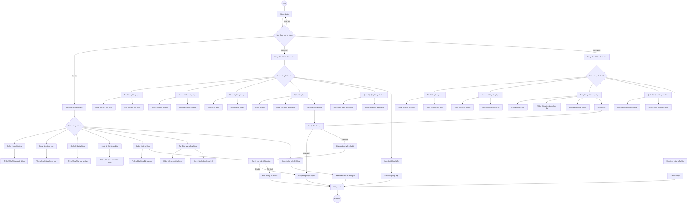

```mermaid
graph TD
    %% Main System Flow
    Start((Start)) --> Login[Đăng nhập]
    Login --> AuthCheck{Xác thực người dùng}
    AuthCheck -->|Thất bại| Login

    %% Role-based Flow
    AuthCheck -->|Admin| AdminDashboard[Bảng điều khiển Admin]
    AuthCheck -->|Giáo viên| TeacherDashboard[Bảng điều khiển Giáo viên]
    AuthCheck -->|Sinh viên| StudentDashboard[Bảng điều khiển Sinh viên]

    %% Admin Flows
    AdminDashboard --> AdminFeatures{Chức năng Admin}
    AdminFeatures --> A1[Quản lý người dùng]
    AdminFeatures --> A2[Quản lý phòng học]
    AdminFeatures --> A3[Quản lý loại phòng]
    AdminFeatures --> A4[Quản lý thời khóa biểu]
    AdminFeatures --> A5[Quản lý đặt phòng]
    AdminFeatures --> A6[Tự động sắp xếp phòng]
    AdminFeatures --> A7[Xem thống kê hệ thống]

    A1 --> A1_1[Thêm/Sửa/Xóa người dùng]
    A2 --> A2_1[Thêm/Sửa/Xóa phòng học]
    A3 --> A3_1[Thêm/Sửa/Xóa loại phòng]
    A4 --> A4_1[Thêm/Sửa/Xóa thời khóa biểu]
    A5 --> A5_1[Thêm/Sửa/Xóa đặt phòng]
    A5 --> A5_2[Duyệt yêu cầu đặt phòng]
    A6 --> A6_1[Phân tích và gợi ý phòng]
    A6 --> A6_2[Xác nhận hoặc điều chỉnh]
    A7 --> A7_1[Xem báo cáo và thống kê]

    %% Teacher Flows
    TeacherDashboard --> TeacherFeatures{Chức năng Giáo viên}
    TeacherFeatures --> T1[Tìm kiếm phòng học]
    TeacherFeatures --> T2[Xem chi tiết phòng học]
    TeacherFeatures --> T3[Đề xuất phòng trống]
    TeacherFeatures --> T4[Đặt phòng học]
    TeacherFeatures --> T5[Quản lý đặt phòng cá nhân]
    TeacherFeatures --> T6[Xem thời khóa biểu]

    T1 --> T1_1[Nhập tiêu chí tìm kiếm]
    T1 --> T1_2[Xem kết quả tìm kiếm]
    T2 --> T2_1[Xem thông tin phòng]
    T2 --> T2_2[Xem danh sách thiết bị]
    T3 --> T3_1[Chọn thời gian]
    T3 --> T3_2[Xem phòng trống]
    T4 --> T4_1[Chọn phòng]
    T4 --> T4_2[Nhập thông tin đặt phòng]
    T4 --> T4_3[Xác nhận đặt phòng]
    T5 --> T5_1[Xem danh sách đặt phòng]
    T5 --> T5_2[Chỉnh sửa/Hủy đặt phòng]
    T6 --> T6_1[Xem lịch giảng dạy]

    %% Student Flows
    StudentDashboard --> StudentFeatures{Chức năng Sinh viên}
    StudentFeatures --> S1[Tìm kiếm phòng học]
    StudentFeatures --> S2[Xem chi tiết phòng học]
    StudentFeatures --> S3[Đặt phòng nhóm học tập]
    StudentFeatures --> S4[Quản lý đặt phòng cá nhân]
    StudentFeatures --> S5[Xem thời khóa biểu lớp]

    S1 --> S1_1[Nhập tiêu chí tìm kiếm]
    S1 --> S1_2[Xem kết quả tìm kiếm]
    S2 --> S2_1[Xem thông tin phòng]
    S2 --> S2_2[Xem danh sách thiết bị]
    S3 --> S3_1[Chọn phòng trống]
    S3 --> S3_2[Nhập thông tin nhóm học tập]
    S3 --> S3_3[Gửi yêu cầu đặt phòng]
    S3 --> S3_4[Chờ duyệt]
    S4 --> S4_1[Xem danh sách đặt phòng]
    S4 --> S4_2[Chỉnh sửa/Hủy đặt phòng]
    S5 --> S5_1[Xem lịch học]

    %% Common flows
    A5_2 -->|Duyệt| BookingApproved[Đặt phòng được duyệt]
    A5_2 -->|Từ chối| BookingRejected[Đặt phòng bị từ chối]

    T4_3 --> BookingProcessing[Xử lý đặt phòng]
    S3_4 --> BookingProcessing

    BookingProcessing -->|Giáo viên| BookingApproved
    BookingProcessing -->|Sinh viên| NeedApproval[Cần quản trị viên duyệt]
    NeedApproval --> A5_2

    %% Logging out
    A7_1 --> Logout[Đăng xuất]
    T6_1 --> Logout
    S5_1 --> Logout
    BookingApproved --> Logout
    BookingRejected --> Logout

    Logout --> End((Kết thúc))
```
