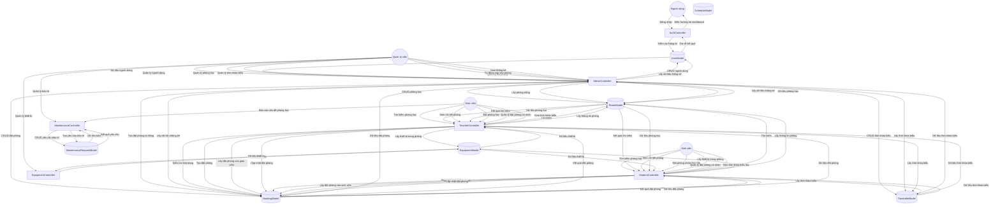

```mermaid
graph TD
    %% User Entities
    User((Người dùng))
    Admin((Quản trị viên))
    Teacher((Giáo viên))
    Student((Sinh viên))

    %% Database Models
    UserDB[(UserModel)]
    RoomDB[(RoomModel)]
    BookingDB[(BookingModel)]
    TimetableDB[(TimetableModel)]
    EquipmentDB[(EquipmentModel)]
    MaintenanceDB[(MaintenanceRequestModel)]
    ScheduleDB[(ScheduleModel)]

    %% Authentication Flow
    User -->|Đăng nhập| AuthController
    AuthController -->|Kiểm tra thông tin| UserDB
    UserDB -->|Trả về kết quả| AuthController
    AuthController -->|Điều hướng tới dashboard| User

    %% Admin Data Flows
    Admin -->|Quản lý người dùng| AdminController
    AdminController -->|CRUD người dùng| UserDB
    UserDB -->|Dữ liệu người dùng| AdminController

    Admin -->|Quản lý phòng học| AdminController
    AdminController -->|CRUD phòng học| RoomDB
    RoomDB -->|Dữ liệu phòng học| AdminController

    Admin -->|Quản lý thời khóa biểu| AdminController
    AdminController -->|CRUD thời khóa biểu| TimetableDB
    TimetableDB -->|Dữ liệu thời khóa biểu| AdminController

    Admin -->|Quản lý đặt phòng| AdminController
    AdminController -->|CRUD đặt phòng| BookingDB
    BookingDB -->|Dữ liệu đặt phòng| AdminController

    Admin -->|Tự động sắp xếp phòng| AdminController
    AdminController -->|Lấy phòng trống| RoomDB
    AdminController -->|Lấy thời khóa biểu| TimetableDB
    AdminController -->|Tạo đặt phòng tự động| BookingDB

    Admin -->|Xem thống kê| AdminController
    AdminController -->|Lấy dữ liệu thống kê| RoomDB
    AdminController -->|Lấy dữ liệu thống kê| BookingDB
    AdminController -->|Lấy dữ liệu thống kê| UserDB

    %% Teacher Data Flows
    Teacher -->|Tìm kiếm phòng học| TeacherController
    TeacherController -->|Tìm kiếm| RoomDB
    RoomDB -->|Kết quả tìm kiếm| TeacherController

    Teacher -->|Xem chi tiết phòng| TeacherController
    TeacherController -->|Lấy thông tin phòng| RoomDB
    TeacherController -->|Lấy thiết bị trong phòng| EquipmentDB
    RoomDB -->|Dữ liệu phòng học| TeacherController
    EquipmentDB -->|Dữ liệu thiết bị| TeacherController

    Teacher -->|Đặt phòng học| TeacherController
    TeacherController -->|Kiểm tra khả dụng| BookingDB
    TeacherController -->|Tạo đặt phòng| BookingDB
    BookingDB -->|Kết quả đặt phòng| TeacherController

    Teacher -->|Quản lý đặt phòng cá nhân| TeacherController
    TeacherController -->|Lấy đặt phòng của giáo viên| BookingDB
    TeacherController -->|Cập nhật đặt phòng| BookingDB
    BookingDB -->|Dữ liệu đặt phòng| TeacherController

    Teacher -->|Xem thời khóa biểu| TeacherController
    TeacherController -->|Lấy thời khóa biểu| TimetableDB
    TimetableDB -->|Dữ liệu thời khóa biểu| TeacherController

    %% Student Data Flows
    Student -->|Tìm kiếm phòng học| StudentController
    StudentController -->|Tìm kiếm| RoomDB
    RoomDB -->|Kết quả tìm kiếm| StudentController

    Student -->|Xem chi tiết phòng| StudentController
    StudentController -->|Lấy thông tin phòng| RoomDB
    StudentController -->|Lấy thiết bị trong phòng| EquipmentDB
    RoomDB -->|Dữ liệu phòng học| StudentController
    EquipmentDB -->|Dữ liệu thiết bị| StudentController

    Student -->|Đặt phòng nhóm học tập| StudentController
    StudentController -->|Kiểm tra khả dụng| BookingDB
    StudentController -->|Tạo đặt phòng chờ duyệt| BookingDB
    BookingDB -->|Kết quả đặt phòng| StudentController

    Student -->|Quản lý đặt phòng cá nhân| StudentController
    StudentController -->|Lấy đặt phòng của sinh viên| BookingDB
    StudentController -->|Cập nhật đặt phòng| BookingDB
    BookingDB -->|Dữ liệu đặt phòng| StudentController

    Student -->|Xem thời khóa biểu lớp| StudentController
    StudentController -->|Lấy thời khóa biểu| TimetableDB
    TimetableDB -->|Dữ liệu thời khóa biểu| StudentController

    %% Maintenance Flows
    Admin -->|Quản lý bảo trì| MaintenanceController
    MaintenanceController -->|CRUD yêu cầu bảo trì| MaintenanceDB
    MaintenanceDB -->|Dữ liệu bảo trì| MaintenanceController

    Teacher -->|Báo cáo vấn đề phòng học| MaintenanceController
    MaintenanceController -->|Tạo yêu cầu bảo trì| MaintenanceDB
    MaintenanceDB -->|Kết quả yêu cầu| MaintenanceController

    %% Equipment Flows
    Admin -->|Quản lý thiết bị| EquipmentController
    EquipmentController -->|CRUD thiết bị| EquipmentDB
    EquipmentDB -->|Dữ liệu thiết bị| EquipmentController
```
