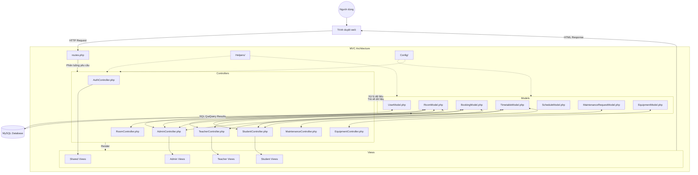

```mermaid
graph TD
    %% User Interaction
    User((Người dùng)) --> Browser[Trình duyệt web]
    Browser --> |HTTP Request| Router

    %% MVC Structure
    subgraph MVC["MVC Architecture"]

        %% Controllers
        subgraph Controllers["Controllers"]
            AuthController[AuthController.php]
            AdminController[AdminController.php]
            TeacherController[TeacherController.php]
            StudentController[StudentController.php]
            RoomController[RoomController.php]
            MaintenanceController[MaintenanceController.php]
            EquipmentController[EquipmentController.php]
        end

        %% Models
        subgraph Models["Models"]
            UserModel[UserModel.php]
            RoomModel[RoomModel.php]
            BookingModel[BookingModel.php]
            TimetableModel[TimetableModel.php]
            ScheduleModel[ScheduleModel.php]
            MaintenanceRequestModel[MaintenanceRequestModel.php]
            EquipmentModel[EquipmentModel.php]
        end

        %% Views
        subgraph Views["Views"]
            AdminViews[Admin Views]
            TeacherViews[Teacher Views]
            StudentViews[Student Views]
            SharedViews[Shared Views]
        end

        %% Router
        Router[routes.php] --> |Phân luồng yêu cầu| Controllers

        %% Controllers to Models
        Controllers --> |Xử lý dữ liệu| Models
        Models --> |Trả về dữ liệu| Controllers

        %% Controllers to Views
        Controllers --> |Render| Views

        %% Helpers
        Helpers[Helpers/] -.-> Controllers
        Helpers -.-> Models

        %% Configuration
        Config[Config/] -.-> Models
        Config -.-> Controllers

    end

    %% Database
    Models --> |SQL Queries| Database[(MySQL Database)]
    Database --> |Query Results| Models

    %% Response
    Views --> |HTML Response| Browser

    %% Specific connections
    AdminController --> AdminViews
    TeacherController --> TeacherViews
    StudentController --> StudentViews
    AuthController --> SharedViews

    UserModel <--> AdminController
    RoomModel <--> RoomController
    RoomModel <--> AdminController
    RoomModel <--> TeacherController
    RoomModel <--> StudentController
    BookingModel <--> AdminController
    BookingModel <--> TeacherController
    BookingModel <--> StudentController
    TimetableModel <--> AdminController
    TimetableModel <--> TeacherController
    TimetableModel <--> StudentController
    EquipmentModel <--> EquipmentController
    MaintenanceRequestModel <--> MaintenanceController
```
